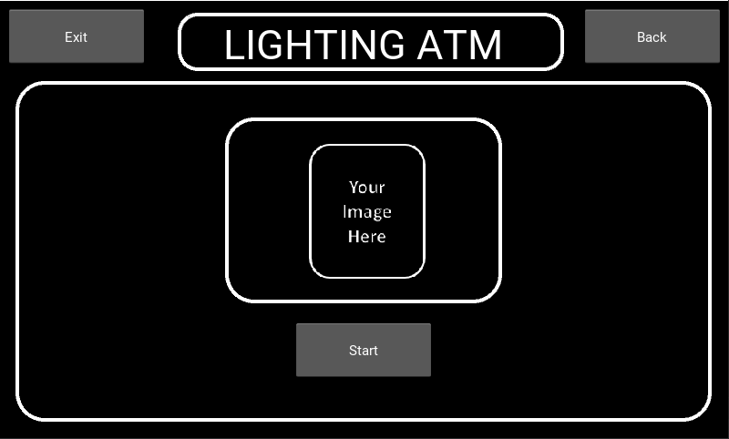

# Kivy Lightning ATM
This is a Lightning ATM based on Kivy language. Therefore you can use the screen as touchscreen.
The project is based and inspired by the Lightning ATM by 21isenough. Have a look at his github-page: [21isenough - Github](https://github.com/21isenough/LightningATM)

Everything in this code is highly documented, so check out the notes first.



# Hardware
Stepup Converter
*  to power the CoinAcceptor with the RaspberryPi
*  coin acceptor takes 12V
*  RaspberryPi delivers 5V
*  Stepup Converter takes 5V and delivers 12V
*  [Step Up Converter](https://www.amazon.de/gp/product/B07MKGN6M4/ref=ppx_yo_dt_b_asin_title_o08_s00?ie=UTF8&psc=1)

RaspberryPi
* to run the app
* if you have a sufficiant power device you don't need the complete kit
* [RaspberryPi Kit](https://www.amazon.de/UCreate-Raspberry-Pi-Desktop-Starter/dp/B07BNPZVR7/ref=sr_1_5?__mk_de_DE=%C3%85M%C3%85%C5%BD%C3%95%C3%91&dchild=1&keywords=raspberry+pi+3b%2B&qid=1586543795&sr=8-5)
* [RaspberryPi single](https://www.amazon.de/Raspberry-1373331-Modell-Mainboard-1GB/dp/B07BFH96M3/ref=sr_1_5?__mk_de_DE=%C3%85M%C3%85%C5%BD%C3%95%C3%91&dchild=1&keywords=%22raspberry+pi+3b%2B%22&qid=1586544121&sr=8-5)

SD-Card
* if you don't have one and didn't order it through the RaspberryPi kit
* [SD-Card](https://www.amazon.de/gp/product/B073JWXGNT/ref=ppx_yo_dt_b_asin_title_o04_s01?ie=UTF8&psc=1)

Jumper Wire
* to connect the devices
* female - female, female - male, male - male
* [Jumper Wire](https://www.amazon.de/gp/product/B01EV70C78/ref=ppx_yo_dt_b_asin_title_o03_s00?ie=UTF8&psc=1)

Flexcable for RaspberryPi Camera
* I also ordered an additional flex cable, because the default one is very short
* [Flex Cable](https://www.amazon.de/gp/product/B01N5RS4R2/ref=ppx_yo_dt_b_asin_title_o02_s00?ie=UTF8&psc=1)

Raspberry Pi V2.1 Camera
* please also look in the FAQ-section because there are some issues with the V2.1 regarding the focus

* [RaspberryPi Camerea V2.1](https://www.amazon.de/gp/product/B01ER2SKFS/ref=ppx_yo_dt_b_asin_title_o03_s01?ie=UTF8&psc=1)

Raspberry Pi Touchscreen
* I used 7", other screens are currently not tested
* also look for a proper power supply
* [TouchScreen mit Gehäuse](https://www.amazon.de/Raspberry-Pi-Touchscreen-Display-Geh%C3%A4use/dp/B01M0AT5O5/ref=sr_1_15?__mk_de_DE=%C3%85M%C3%85%C5%BD%C3%95%C3%91&dchild=1&keywords=raspberry+pi+3&qid=1586543678&sr=8-15)

CoinAcceptor
* I used the model 616 for this
* it's easy to set up and works properly
* [CoinAcceptor](https://www.amazon.de/gp/product/B07DKBF1ZV/ref=ppx_yo_dt_b_asin_title_o01_s01?ie=UTF8&psc=1)

Buttons for future usage
* these are opitional and not necessary
* [Buttons for future usage](https://www.amazon.de/gp/product/B07N1N1T7R/ref=ppx_yo_dt_b_asin_title_o03_s00?ie=UTF8&psc=1)

# Hardware Setup


# Software
Raspbian Image
* [Raspbian Buster with desktop](https://www.raspberrypi.org/downloads/raspbian/)
* I'm not shure if the desktop version is really necessary
* if you want to know more about your pin numbers, you can simply enter the following in the command prompt
    ```sh
    $ pinout
    ```
    

Kivy environment
* I used the installation guide for RaspberryPi
* check if you have the correct python version for kivy
* [Installation tutorial](https://kivy.org/doc/stable/installation/installation-rpi.html)

Libraries
* zbarlight == 3.0
* qrcode == 6.1
* install both of them with 
```sh
$ pip3 install -r "libraries.txt"
```

RaspberryPi Camera
* you have to activate your camera in 
    ```sh
    $ sudo raspi-config
    ```
    - Interfaces
    - Camera

BTCPAY-Server
* at the moment you need a btcpay-server because you can access the rest api really easy
* [BTCPAY-Server Deployment](https://docs.btcpayserver.org/deployment/deployment)
* you also need the admin macaroon which you can also access very easy
* paste your credentials into the shared_values file
* you find your credentials as follows
-- Sever settings
-- Services
-- LND (REST server) - See Information
-- More details... by clicking here
-- take the REST Uri --> paste into shared_values --> '.../lnd-rest/btc/v1'
-- take the AdminMacaroon --> paste into shared_values --> it should be in hex format

# Software/Class Setup


# FAQ

##### Why I can't scan qr-codes?
The RaspberryPi camera has some known focus and resolution issues. To fix them you can do the following:
* a update is needed for full resolution
    ```sh 
    $ sudo apt-get install cmake
    $ git clone https://github.com/raspberrypi/userland.git
    $ cd userland
    $ ./buildme
    ```
    after it a kernel update is necessary
    ```sh
    $ sudo rpi-update
    ```
* You have to manually focus your camera, which is         really easy, if you are extremly carefull

    
    
    Take something sharp like a pencil or your fingernail and try to turn the lense circa a quarter to the left or to the right.
    You can use the nipples on the lense
    Check your improvement by using the qr-test-code
    Be very careful and do not overtwist the lense holder. The distance to the smartphone is approximately 10cm

# Run

1. download raspbian and set it up
2. if you start your touchscreen for the first time and your screen is upside down, do the following:
    ```sh
    $ sudo nano /boot/config.txt
    ```
    - write in the first line: ```lcd_rotate=2```
    - save, exit and reboot
    
3. acitvate your camera in the raspi-config
4. download and install kivy - replace 'python' with 'python3' ! and be patient
5. fix your camera settings
    ```sh 
    $ sudo apt-get install cmake
    $ git clone https://github.com/raspberrypi/userland.git
    $ cd userland
    $ ./buildme
    ```
    after it a kernel update is necessary
    ```sh
    $ sudo rpi-update
    ```
6. download all the Kivy Lightning ATM files
7. install the libraries.txt
    ```sh
    $ pip3 install -r "libraries.txt"
    ```
If you have done everthing correctly, download the files from Github, go to the directory and start the Kivy Lightning ATM with
```sh
$ python3 app.py
```

